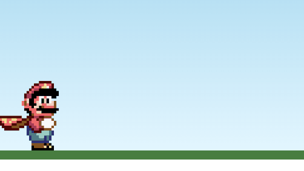

# 🎮 Mario Jump Game

Um mini jogo inspirado no clássico Mario, feito com **HTML, CSS e JavaScript**.  
O objetivo é pular os obstáculos (pipes) e evitar a colisão.  
Se o Mario bater no pipe ou não pular alto o suficiente, aparece um botão para reiniciar o jogo.

---

## 🚀 Tecnologias utilizadas
- HTML5
- CSS3 (animações e estilos)
- JavaScript (lógica do jogo)

---

## 📂 Estrutura do projeto
mario-game/
│── index.html
│── style.css
│── script.js
└── img/
├── mario.png
├── game-over.png
└── pipe.png

---

## ▶️ Como jogar
1. Abra o arquivo `index.html` em seu navegador.  
2. Pressione qualquer tecla para fazer o Mario **pular**.  
3. Evite bater nos pipes.  
4. Se perder, clique no botão **Reiniciar Jogo** para jogar novamente.

---

## 🖼️ Demonstração

---

## 📌 Autor
Desenvolvido por **Priscila Souza** ✨  
